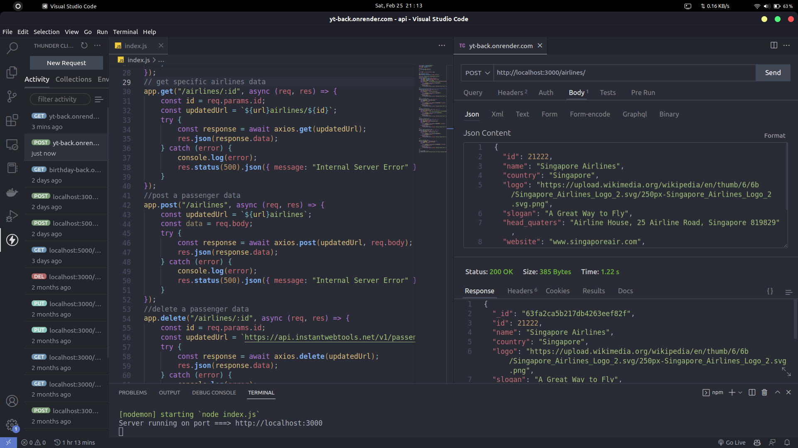

# Api Documentation
## Introduction
This is a simple api documentation for the api endpoints of the application. The api endpoints are listed below.

### API URL : ```https://external-api.onrender.com```

## Endpoints

### 1. GET /airlines

This endpoint returns a list of airlines.

#### Request

```bash
curl -X GET "https://external-api.onrender.com/airlines" -H "accept: application/json"
```


#### Response

```json
[
  {
  "totalPassengers": 5114,
  "totalPages": 512,
  "data": [
    {
      "_id": "63e569ad513ada7fda4005e2",
      "name": "Priya Clements",
      "trips": 200,
      "airline": [
        {
          "id": 2,
          "name": "Singapore Airlines",
          "country": "Singapore",
          "logo": "https://upload.wikimedia.org/wikipedia/en/thumb/6/6b/Singapore_Airlines_Logo_2.svg/250px-Singapore_Airlines_Logo_2.svg.png",
          "slogan": "A Great Way to Fly",
          "head_quaters": "Airline House, 25 Airline Road, Singapore 819829",
          "website": "www.singaporeair.com",
          "established": "1947"
        }
      ],
      "__v": 0
    },
]
```

### 2. GET /airlines/:id

This endpoint returns a single airline.

#### Request

```bash

curl -X GET "https://external-api.onrender.com/airlines/63e569ad513ada7fda4005e2" -H "accept: application/json"
```

#### Response

```json
{
  "_id": "63e569ad513ada7fda4005e2",
  "name": "Priya Clements",
  "trips": 200,
  "airline": [
    {
      "id": 2,
      "name": "Singapore Airlines",
      "country": "Singapore",
      "logo": "https://upload.wikimedia.org/wikipedia/en/thumb/6/6b/Singapore_Airlines_Logo_2.svg/250px-Singapore_Airlines_Logo_2.svg.png",
      "slogan": "A Great Way to Fly",
      "head_quaters": "Airline House, 25 Airline Road, Singapore 819829",
      "website": "www.singaporeair.com",
      "established": "1947"
    }
  ],
  "__v": 0
}
```

### 3. POST /airlines

This endpoint creates a new airline.

#### Request

```bash
curl -X POST "https://external-api.onrender.com/airlines" -H "accept: application/json" -H "Content-Type: application/json" -d "{ \"name\": \"Priya Clements\", \"trips\": 200, \"airline\": [ { \"id\": 2, \"name\": \"Singapore Airlines\", \"country\": \"Singapore\", \"logo\": \"https://upload.wikimedia.org/wikipedia/en/thumb/6/6b/Singapore_Airlines_Logo_2.svg/250px-Singapore_Airlines_Logo_2.svg.png\", \"slogan\": \"A Great Way to Fly\", \"head_quaters\": \"Airline House, 25 Airline Road, Singapore 819829\", \"website\": \"www.singaporeair.com\", \"established\": \"1947\" } ]}"
```

#### Response

```json
{
  "_id": "63e569ad513ada7fda4005e2",
  "name": "Priya Clements",
  "trips": 200,
  "airline": [
    {
      "id": 2,
      "name": "Singapore Airlines",
      "country": "Singapore",
      "logo": "https://upload.wikimedia.org/wikipedia/en/thumb/6/6b/Singapore_Airlines_Logo_2.svg/250px-Singapore_Airlines_Logo_2.svg.png",
      "slogan": "A Great Way to Fly",
      "head_quaters": "Airline House, 25 Airline Road, Singapore 819829",
      "website": "www.singaporeair.com",
      "established": "1947"
    }
  ],
  "__v": 0
}
```

### 4. PUT /passenger/:id

This endpoint updates an airline.

#### Request

```bash
curl -X PUT "https://external-api.onrender.com/airlines/63e569ad513ada7fda4005e2" -H "accept: application/json" -H "Content-Type: application/json" -d {
    "name": "John Doe",
    "trips": 500,
    "airline": 8
}"
```

#### Response

```json
{
  "_id": "63e569ad513ada7fda4005e2",
  "name": "John Doe",
  "trips": 500,
  "airline": [
    {
      "id": 8,
      "name": "Air Canada",
      "country": "Canada",
      "logo": "https://upload.wikimedia.org/wikipedia/commons/thumb/d/d9/Air_Canada_Logo.svg/250px-Air_Canada_Logo.svg.png",
      "slogan": "Fly the Flag",
      "head_quaters": "Montreal, Quebec, Canada",
      "website": "www.aircanada.com",
      "established": "1937"
    }
  ],
  "__v": 0
}
```

### 5. DELETE /airlines/:id

This endpoint deletes an airline.

#### Request

```bash
curl -X DELETE "https://external-api.onrender.com/airlines/63e569ad513ada7fda4005e2" -H "accept: application/json"
```

#### Response

```json
{
  "message": "Airline deleted successfully"
}
```

### 6. GET /passenger/:id

This endpoint returns a single passenger.

#### Request

```bash
curl -X GET "https://external-api.onrender.com/passenger/63e569ad513ada7fda4005e2" -H "accept: application/json"
```

#### Response

```json
{
  "_id": "63e569ad513ada7fda4005e2",
  "name": "Priya Clements",
  "trips": 200,
  "airline": [
    {
      "id": 2,
      "name": "Singapore Airlines",
      "country": "Singapore",
      "logo": "https://upload.wikimedia.org/wikipedia/en/thumb/6/6b/Singapore_Airlines_Logo_2.svg/250px-Singapore_Airlines_Logo_2.svg.png",
      "slogan": "A Great Way to Fly",
      "head_quaters": "Airline House, 25 Airline Road, Singapore 819829",
      "website": "www.singaporeair.com",
      "established": "1947"
    }
  ],
  "__v": 0
}
```
### Reference image

<!-- add image from image folder -->

 




### Use Docker

```bash
docker build -t external-api .
docker run -p 3000:3000 external-api
# IF PORT 3000 IS ALREADY IN USE
docker run -p 3001:3000 external-api

# IF YOU WANT TO RUN IN BACKGROUND
docker run -d -p 3000:3000 external-api

```


